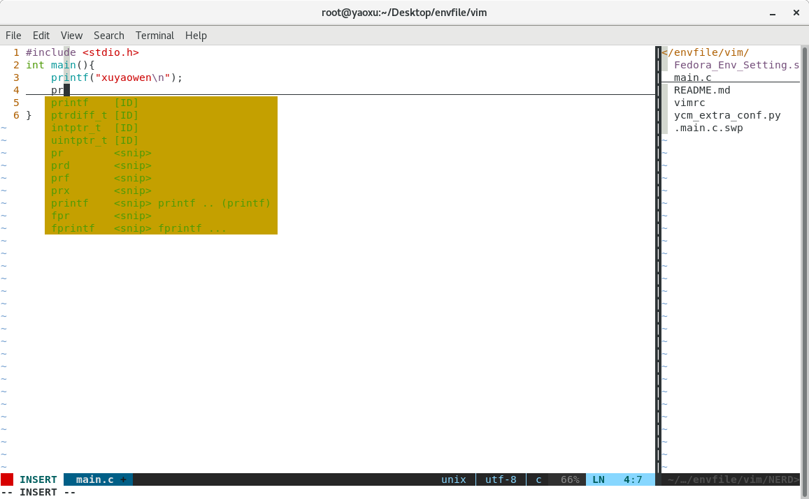

## Vim Env
Vim environment settings

## Details
详细的vim 的使用指导：
[Linux ： Vim 使用与配置](https://www.cnblogs.com/xuyaowen/p/vim_usage.html)

## Files
Vim 配置文件：
- vimrc

Vim 配置脚本：
- Fedora_Env_Setting.sh

## 效果图


### NeoVim
```bash
# 使用 apt 安装
apt update
apt install neovim
```